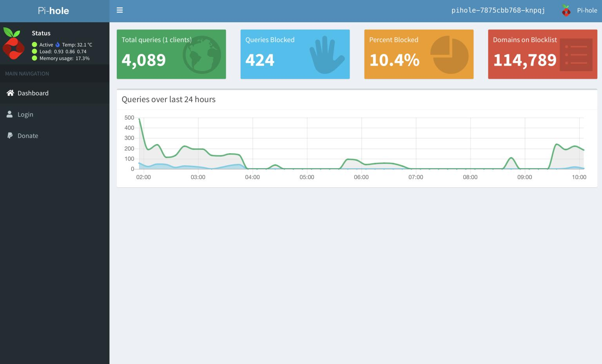
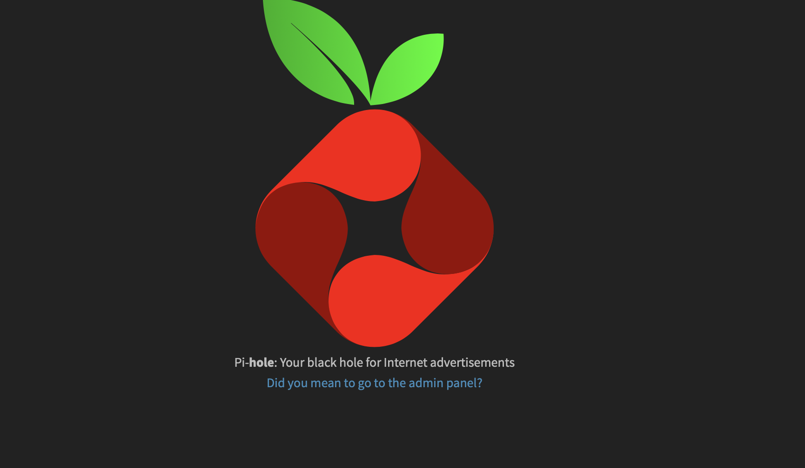

#  Easy Deploy of Pi-hole to K3s on RPi 4B 

<code></code>
<code></code>


This project was built on a Raspberry Pi 4B running Raspian buster and Rancher K3s.

 


## Pi-hole 🥧 🕳

Pi-hole is a Linux network-level advertisement and Internet tracker blocking application which acts as a DNS sinkhole (and optionally a DHCP server), 
intended for use on a private network. It is designed for use on embedded devices with network capability, such as the Raspberry Pi, 
but it can be used on other machines running Linux and cloud implementations.
Pi-hole has the ability to block traditional website advertisements as well as advertisements in unconventional places, 
such as smart TVs and mobile operating system advertisements.





Some notable features include:

* Password protection
* Detailed graphs 
* Top lists of blocked domains and clients
* A filterable and sortable query log
* Long Term Statistics to view data over user-defined time ranges
* The ability to easily manage and configure Pi-hole features


## Pre Reqs (before you apply the manifests) ⚠️
If using Metallb

✅  In the metallb-configmap.yaml file you need to set the IP ranges to match your network.

```
  config: |
    address-pools:
    - addresses:
      - 192.168.161.204-192.168.161.214
      name: default
      protocol: layer2
    - addresses:
      - 192.168.161.215-192.168.161.224
      name: network-services
      protocol: layer2
```


✅  k3s uses the stable/traefik helm chart to deploy the ingress controller with service type LoadBalancer, and the ports there are hardcoded to 443 and 80.

We will be removing Traefik so our pihole-tcp service can use port 80 on the node instead.

```
$ kubectl get svc -n kube-system
NAME             TYPE           CLUSTER-IP      EXTERNAL-IP       PORT(S)                                     AGE
kube-dns         ClusterIP      10.43.0.10      <none>            53/UDP,53/TCP,9153/TCP                      14m
metrics-server   ClusterIP      10.43.177.238   <none>            443/TCP                                     14m
traefik          LoadBalancer   10.43.52.84     192.168.161.104   80:32185/TCP,443:31801/TCP,8080:30008/TCP   12m


$ kubectl delete -n kube-system helmcharts traefik
helmchart.helm.cattle.io "traefik" deleted

$ kubectl get svc -n kube-system
NAME             TYPE        CLUSTER-IP      EXTERNAL-IP   PORT(S)                  AGE
kube-dns         ClusterIP   10.43.0.10      <none>        53/UDP,53/TCP,9153/TCP   21m
metrics-server   ClusterIP   10.43.177.238   <none>        443/TCP                  21m
```


## Quick  Start(Time to deploy Pi-hole on K3s) 🚀


```

$ cd k3s-pi-hole

$ kubectl apply -f manifests/

```
If you get an error while applying the manifests, run kubectl apply -f manifests/ again. Sometimes the resources required are not deployed yet.


## Success 🎉

Now you should be able to access the Pi-hole web Gui at http://(node-IP):30007 and http://(node-IP)/admin




The login password is: admin

## Update

The Web interface password needs to be reset via the command line on your Pi-hole. This can be done locally or over SSH. You will use the pihole command to do this:

pihole -a -p
You will be prompted for the new password. If you enter an empty password, the password requirement will be removed from the web interface.


##Get a Shell to a Running Container
This page shows how to use kubectl exec to get a shell to a running container.

https://kubernetes.io/docs/tasks/debug-application-cluster/get-shell-running-container/

```
colinmccarthy@Colins-MBP work % k exec --stdin --tty pihole-687f4b5567-bk8s2 -- /bin/bash
root@pihole-687f4b5567-bk8s2:/# pihole -a -p
Enter New Password (Blank for no password): 
Confirm Password: 
  [✓] New password set
root@pihole-687f4b5567-bk8s2:/# 
root@pihole-687f4b5567-bk8s2:/# 
```


